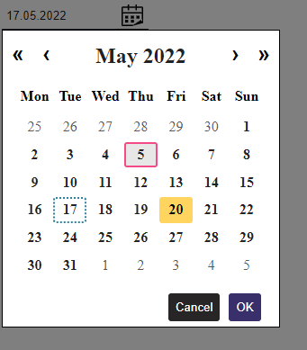

# vue-accessible-date-field
Vue date field with possibility to use a visual date picker to choose the date. Accessibility is under development. Not recommended to use this component until version 1.0.0 is released. Component is made with Vue 3.

**Date field:**


**Date picker** showing selected date with dotted border, focused but not selected date with yellow background color and hovered date with light gray background and pink border.




## Installing component with npm
If installing was recommended it would happen with the following command: 
```
npm install vue-accessible-date-field
```

## Props
| Property  | Type | Default Value | Good to Know |
| ------------- | ------------- | ------------- | ------------- |
| defaultDate  | String  |  | Format: "yyyy-mm-dd". If not given, datePicker uses current date when first loaded |
| uniqueName  | String |   | used to make id:s inside component unique between multiple vue-accessible-date-pickers on the same page. If not given the string will be replaced with "undefined" in id:s. E.g. id="dateField-undefined"   |
| usedLanguage | String  | "fi" | default language will be changed to English soon. It it possible to use values "en" for English, "sv" for Swedish and "fi" for Finnish |
| localizationEn  | Localization {<br />locale: string, placeholderText: string, dateFormatString: string, wordOrTranslated: string, dateFormatOptions: string[], generalDateFieldError: string, buttonLabelChoose: string, buttonLabelChange: string, dayNames: string[], monthNames: string[], monthNamesForMessage: string[], dayNamesShort: string[], selectFocusedButtonLabel: string, cancelButtonLabel: string<br />} | Localization = {<br />locale: 'en-GB', placeholderText: 'e.g. dd.mm.yyyy', dateFormatString: 'date format: ', wordOrTranslated: 'or', dateFormatOptions: ['dd.mm.yyyy', 'dd-mm-yyyy', 'dd/mm/yyyy'], generalDateFieldError: 'The entered date format is invalid', buttonLabelChoose: 'Choose date', buttonLabelChange: 'Change selected date, ', dayNames: ['Tuesday', 'Wednesday', 'Thursday', 'Friday', 'Saturday', 'Sunday'], monthNames: ['January', 'February', 'March', 'April', 'May', 'June', 'July', 'August', 'September', 'October', 'November', 'December'], monthNamesForMessage: ['January', 'February', 'March', 'April', 'May', 'June', 'July', 'August', 'September', 'October', 'November', 'December'], dayNamesShort: ['Mon', 'Tue', 'Wed', 'Thu', 'Fri', 'Sat', 'Sun'], selectFocusedButtonLabel: 'OK', cancelButtonLabel: 'Cancel'<br />} |   |
| localizationFi  | Localization {<br />locale: string, placeholderText: string, dateFormatString: string, wordOrTranslated: string, dateFormatOptions: string[], generalDateFieldError: string, buttonLabelChoose: string, buttonLabelChange: string, dayNames: string[], monthNames: string[], monthNamesForMessage: string[], dayNamesShort: string[], selectFocusedButtonLabel: string, cancelButtonLabel: string<br />} | Localization = {<br />locale: 'fi-FI', placeholderText: 'esim. pp.kk.vvvv', dateFormatString: 'päivämäärän muoto: ', wordOrTranslated: 'tai', dateFormatOptions: ['pp.kk.vvvv', 'pp-kk-vvvv', 'pp/kk/vvvv'], generalDateFieldError: 'Syöttämäsi päivämäärän muoto ei kelpaa', buttonLabelChoose: 'Valitse päivämäärä', buttonLabelChange: 'Muuta valittua päivämäärää, ', dayNames: ['maanantai', 'tiistai', 'keskiviikko', 'torstai', 'perjantai', 'lauantai', 'sunnuntai'], monthNames: ['tammikuu', 'helmikuu', 'maaliskuu', 'huhtikuu', 'toukokuu', 'kesäkuu', 'heinäkuu', 'elokuu', 'syyskuu', 'lokakuu', 'marraskuu', 'joulukuu'], monthNamesForMessage: ['tammikuuta', 'helmikuuta', 'maaliskuuta', 'huhtikuuta', 'toukokuuta', 'kesäkuuta', 'heinäkuuta', 'elokuuta', 'syyskuuta', 'lokakuuta', 'marraskuuta', 'joulukuuta'], dayNamesShort: ['ma', 'ti', 'ke', 'to', 'pe', 'la', 'su'], selectFocusedButtonLabel: 'OK', cancelButtonLabel: 'Peruuta'<br />}  |   |
| localizationSv  | Localization {<br />locale: string, placeholderText: string, dateFormatString: string, wordOrTranslated: string, dateFormatOptions: string[], generalDateFieldError: string, buttonLabelChoose: string, buttonLabelChange: string, dayNames: string[], monthNames: string[], monthNamesForMessage: string[], dayNamesShort: string[], selectFocusedButtonLabel: string, cancelButtonLabel: string<br />} | Localization = {<br />locale: 'sv-SE', placeholderText: 'T.ex. dd.mm.åååå', dateFormatString: 'datumformat: ', wordOrTranslated: 'eller', dateFormatOptions: ['dd.mm.åååå', 'dd-mm-åååå', 'dd/mm/åååå'], generalDateFieldError: 'Datumformatet du angav är ogiltigt', buttonLabelChoose: 'Välj ett datum', buttonLabelChange: 'Ändra det valda datumet, ', dayNames: ['måndag', 'tisdag', 'onsdag', 'torsdag', 'fredag', 'lördag', 'söndag'], monthNames: ['januari', 'februari', 'mars', 'april', 'maj', 'juni', 'juli', 'augusti', 'september', 'oktober', 'november', 'december'], monthNamesForMessage: ['januari', 'februari', 'mars', 'april', 'maj', 'juni', 'juli', 'augusti', 'september', 'oktober', 'november', 'december'], dayNamesShort: ['må', 'ti', 'on', 'to', 'fr', 'lö', 'sö'], selectFocusedButtonLabel: 'OK', cancelButtonLabel: 'Avbryt'<br />}  |  |

There will soon be possibility to add localization also to other languages. 

To promote accessibility please make sure that date field's label you add has the same for-attribute that text field itself has.


## Emits

|  Event  | Type | Good to Know |
| ----------- | ----------- |----------- |
| update:selectedISODate     | String  | event occurs every time user selects new date. Parent component receives it in format yyyy-mm-dd  |